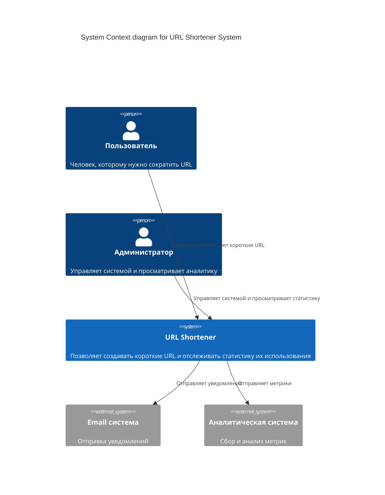
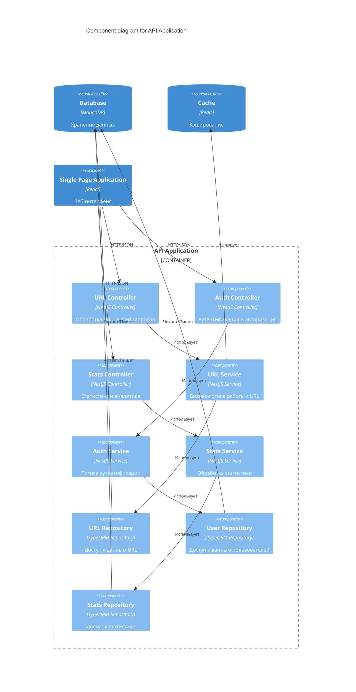
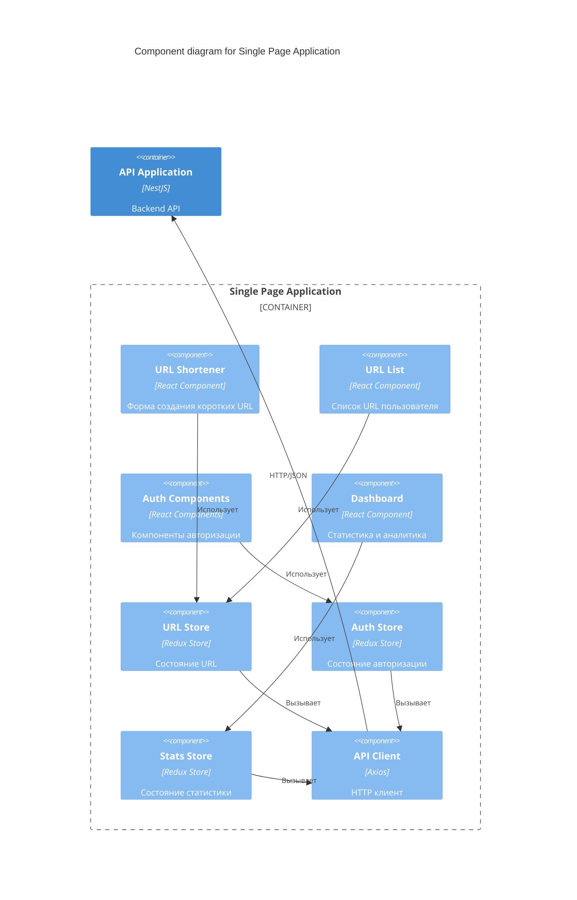

# C4 Модель архитектуры URL-сокращателя

## Уровень 1: Контекст системы (System Context)

## Уровень 2: Контейнеры (Container)

## Уровень 3: Компоненты (Components)

### API Application Components

### Frontend Components Diagram

## Пояснения к диаграммам

### System Context
- Система взаимодействует с двумя типами пользователей: обычными пользователями и администраторами
- Интегрируется с внешними системами для отправки email и сбора аналитики

### Containers
- SPA (React) предоставляет пользовательский интерфейс
- API Application (NestJS) обрабатывает все бизнес-логику
- MongoDB хранит основные данные
- Redis используется для кэширования
- Отдельный сервис аналитики для обработки метрик

### Components
API Application содержит:
- Контроллеры для обработки HTTP запросов
- Сервисы для бизнес-логики
- Репозитории для работы с данными

Frontend содержит:
- React компоненты для UI
- Redux stores для управления состоянием
- API клиент для коммуникации с бэкендом

## Технологический стек

### Backend
- NestJS (Node.js framework)
- TypeScript
- MongoDB с Mongoose
- Redis
- JWT для аутентификации
- Jest для тестирования

### Frontend
- React
- TypeScript
- Redux + Redux Toolkit
- Axios
- Material-UI
- Jest + React Testing Library

### DevOps
- Docker + Docker Compose
- GitHub Actions для CI/CD
- Prometheus + Grafana для мониторинга
